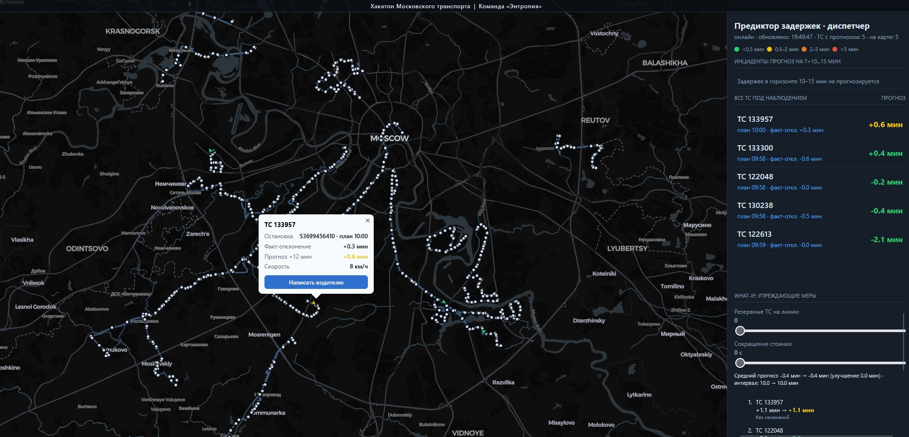

# Transport Delay Predictor


Потоковый ML-прогноз задержек городского транспорта: бинарный поток телеметрии **NDTP** по TCP →
GPS-мэтчинг с расписанием → HMM-привязка к улицам OSM → **CatBoost** → онлайн-инференс → BI-дашборд диспетчера.
Горизонт прогноза — **10–15 минут до события**: время опоздания, причина и участок маршрута срабатывают до сбоя, а не постфактум.

Решение задачи «ИИ-предиктор задержек транспорта» Хакатона московского транспорта, собранное соло за 2 дня с агентами и доведённое до полноценного репозитория.



## Результаты

Оценка на скрытом hold-out, MAE прогнозируемой задержки:

| Модель | MAE, с |
|---|---|
| «задержки нет» | 103.3 |
| экстраполяция текущего отклонения | 93.4 |
| CatBoost + подсказка отклонения (офлайн) | 40.9 |
| **стриминг без подсказок, только GPS** | **42.1** |

Честный стриминг-eval: тестовый трафик прогоняется через онлайн-пайплайн без ground-truth подсказок
(`tools/stream_eval.py`). Потеря качества против офлайна — 1.2 с; против бейзлайна — ускорение в 2.2 раза.
Латентность инференса — единицы–десятки мс на ТС при бюджете 1–2 с (`tools/bench_latency.py`).

## Архитектура

```
replay датасета / эмулятор NDTP
        │  TCP :9201 (NDTP)
        ▼
ML-ядро: парсер NDTP, признаки, CatBoost-инференс   (API :8100)
        │
        ▼
Backend: FastAPI, REST + WebSocket, оркестрация      (API :8000)
        │
        ▼
BI-дашборд: MapLibre, алерты, карточка инцидента     (статика /dashboard)
```

- **NDTP-приём**: бинарный протокол (CRC-16/Modbus), устойчивость к мусору в потоке и обрывам
- **Мэтчинг**: восстановление прохождения остановок по треку; HMM-привязка к графу OSM — участок застревания определяется по имени улицы
- **Прогноз**: CatBoost, 69 признаков, строгая антиутечка (`event_time ≤ T`), LOO-приоры остановок
- **Дашборд**: MapLibre, ТС-стрелки по курсу, риск-цвета, карточка инцидента, What-if сценарии (резервные ТС, сокращение стоянки), WebSocket

## Быстрый старт

Нужен Docker. Датасет телеметрии кладётся в `./dataset` (формат ниже); без него поднимается всё, кроме `replay`.

```bash
docker compose up --build
```

- Дашборд: http://localhost:8000/dashboard/index.html
- Swagger: http://localhost:8000/docs (backend), http://localhost:8100/docs (ml-core)
- NDTP-вход для внешнего потока: TCP :9201

Сервис `replay` превращает CSV датасета в живой NDTP-поток (окно 07:20–11:20, ×600).

## Формат данных

Датасет не входит в репозиторий: подойдёт любой экспорт телеметрии в CSV (`,`, UTF-8).

| `traffic.csv` | |
|---|---|
| `tr_id`, `unit_id` | ID ТС и бортового терминала |
| `event_time` | время телеметрии |
| `lat`, `lon`, `alt` | координаты, высота |
| `speed`, `heading` | скорость (км/ч), курс (°) |
| `location_valid` | достоверность координат |

| `schedule.csv` | |
|---|---|
| `tt_action_item_id` | ID планового прибытия на остановку |
| `tr_id` | ID ТС |
| `time_begin` / `time_fact_begin` | план / факт (факт — только в обучающей выборке) |
| `geom` | точка остановки |

## Ограничения

- **RFM-подобные агрегаты** в датасете выгружены «на всю историю» и могут включать заказы после прогнозируемого момента; для продакшена агрегаты пересчитываются на момент оформления заказа
- **Прогноз покрывает окно (T+10; T+15] мин** первой остановки с плановым прибытием — более дальние горизонты требуют другого подхода (планирование по расписанию, а не по телеметрии)
- **HMM-мэтчинг** работает по кэшу OSM-дорог конкретного города; при смене города нужен новый выгруз Overpass
- **GRU-эксперимент** (PyTorch, бленд с CatBoost) не показал преимущества и оставлен в `tools/gt_gru.py` как исследовательский
- Датасет не входит в репозиторий (объём); формат описан выше, любой CSV-экспорт телеметрии совместим

## Разработка

```bash
pip install -e ".[dev]"
ruff check .        # линтер
pytest              # 18 тестов: протокол NDTP, GPS-фильтры, HMM, привязка потока
python tools/gen_docs.py   # PyDoc → docs/pydoc/
```

Модули независимы и общаются по сети; ML-ядро масштабируется отдельно от backend.
